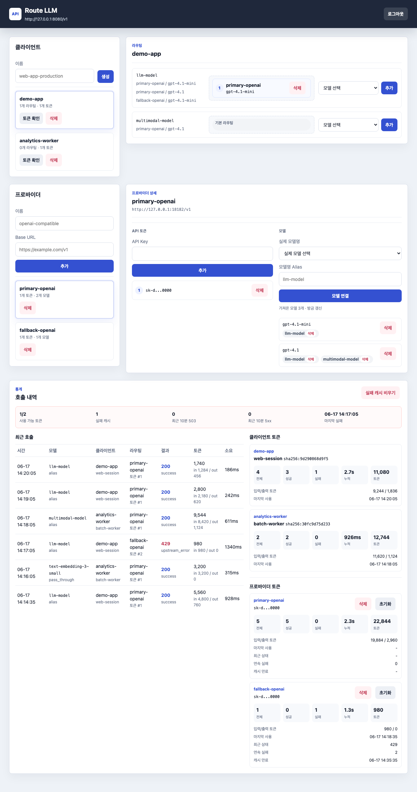

# route-llm

`route-llm` is a small OpenAI-compatible routing proxy for local and
self-hosted use. SDK clients talk to one local base URL and one managed client
token while the router forwards requests to one or more OpenAI-compatible
upstream providers stored in SQLite.

The project is intentionally narrower than a full LLM gateway. It preserves
OpenAI-style request and response bodies, keeps routing and optional Responses
conversation state in SQLite, retries healthy upstream keys in priority order,
and records sanitized operational audit metadata without storing prompts or
responses in audit rows.

## Features

- OpenAI-compatible `/v1/...` proxying for chat, completions, embeddings,
  image, audio, and other supported paths.
- Responses API compatibility for chat-completions upstreams, including
  `input`, `instructions`, function `tools`, `tool_choice`,
  `previous_response_id`, `output`, `output_text`, `usage`, and streaming SSE
  events.
- Public model aliases such as `llm-model` that map to real upstream model ids.
- Per-client routing allowlists for restricting a client to specific upstream
  models.
- Multiple local client tokens per client.
- Multiple upstream providers and API keys, ordered by priority.
- Retry cache for upstream `401`, `403`, `429`, and `5xx` failures using
  `disabled_until`.
- SQLite-backed admin UI for local day-to-day setup.
- Sanitized request audits with status, duration, route, model, token usage, and
  upstream attempt metadata.
- Streaming response proxying with optional SSE usage extraction when upstreams
  emit final `usage` chunks.

## Dashboard Preview



The screenshot uses temporary demo clients, upstreams, model routes, and
sanitized request audit rows. It does not include real provider keys or prompts.

## Local Quick Start

Install a current stable Rust toolchain, then copy the example environment:

```bash
cp .env.example .env
```

Set local bootstrap values in your shell. Use your own OpenAI-compatible
provider URL and model id:

```bash
export ROUTE_LLM_CLIENT_TOKEN="$(openssl rand -hex 24)"
export UPSTREAM_NAME="openai-compatible"
export UPSTREAM_BASE_URL="https://api.example.com/v1"
export UPSTREAM_API_KEY="replace-with-your-provider-key"
export UPSTREAM_MODEL="provider-llm"
```

Initialize SQLite:

```bash
cargo run -- add-client --name local --api-key "$ROUTE_LLM_CLIENT_TOKEN"
cargo run -- add-upstream --name "$UPSTREAM_NAME" --base-url "$UPSTREAM_BASE_URL" --priority 10
cargo run -- add-key --upstream "$UPSTREAM_NAME" --name primary --api-key "$UPSTREAM_API_KEY" --priority 10
cargo run -- add-model-alias --public-model llm-model --target-type llm
cargo run -- add-upstream-model --upstream "$UPSTREAM_NAME" --model "$UPSTREAM_MODEL" --capability llm --priority 10
```

Start the local server:

```bash
cargo run -- serve --bind 127.0.0.1:8080
```

Point an OpenAI-compatible SDK at the router:

```python
from openai import OpenAI

client = OpenAI(
    api_key="the-value-of-ROUTE_LLM_CLIENT_TOKEN",
    base_url="http://127.0.0.1:8080/v1",
)

response = client.chat.completions.create(
    model="llm-model",
    messages=[{"role": "user", "content": "ping"}],
)
print(response.choices[0].message.content)
```

`GET /v1/models` returns public aliases only. Each model item includes
`max_model_len`; the router uses stored upstream-model metadata when available
and falls back to the built-in default.

## Responses API Compatibility

`POST /v1/responses` is implemented as a compatibility layer for upstreams that
support `/v1/chat/completions` but do not expose `/v1/responses` directly. The
router:

- resolves the requested public alias or real upstream model with the normal
  client-aware routing rules;
- converts Responses `input` and optional `instructions` into chat messages;
- maps function `tools`, custom tools, namespace-scoped tools, and compatible
  `tool_choice` values into Chat Completions tool fields;
- keeps OpenAI-hosted built-in tool definitions such as `web_search` and
  `image_generation` as no-op Responses metadata when using the chat adapter;
- forwards the request to the selected upstream's `/chat/completions` endpoint;
- converts JSON responses back into Responses objects with `output`,
  `output_text`, and `usage`;
- converts JSON and streaming tool calls back into Responses `function_call` or
  `custom_tool_call` output items, including namespace metadata;
- converts streaming chat deltas into Responses SSE events such as
  `response.created`, `response.output_text.delta`,
  `response.function_call_arguments.delta`,
  `response.custom_tool_call_input.delta`, and `response.completed`.

If a successful upstream chat response cannot be converted back into Responses
JSON, the request fails as `response_conversion_error` without disabling the
upstream key. Attempt audits keep safe response diagnostics such as upstream
status, content type, body byte count, body hash, and body kind, but not the raw
response body or body prefix. The proxy also strips `Accept-Encoding` before
forwarding so upstream JSON needed for conversion is not returned as compressed
binary data.

`previous_response_id` is supported by storing Responses conversation state in
SQLite and replaying the prior chat message history for the same client. That
state can include user inputs, assistant outputs, and function-call metadata, so
the configured SQLite database must be treated as private runtime state.

The compatibility layer is intentionally limited to text and client-executed
tool-call workflows. The router translates function, custom, and namespace tool
calls so compatible clients can execute them, but the router does not execute
tools itself. It does not implement OpenAI-hosted built-in tools such as hosted
web search or file search.

## Admin UI

Set an admin password to enable `/admin`:

```bash
export ROUTE_LLM_ADMIN_PASSWORD="$(openssl rand -hex 24)"
cargo run -- serve
```

The admin UI can create clients, issue client tokens, add providers, add
provider API keys, register provider models, connect models to public aliases,
set per-client routes, inspect recent sanitized audits, and clear upstream key
failure cache.

Display metadata is configurable and has no project-specific default:

```bash
ROUTE_LLM_ADMIN_SITE_NAME="Route LLM"
ROUTE_LLM_ADMIN_SITE_DESCRIPTION="Local OpenAI-compatible routing proxy"
ROUTE_LLM_PUBLIC_BASE_URL="https://router.example.com"
```

`ROUTE_LLM_PUBLIC_BASE_URL` is optional. It is used only for rendered admin
metadata and display text; it does not expose or bind the server.

## Local Container Run

The included container setup is for local production-like runs, not server
provisioning:

```bash
docker compose -f docker-compose.local.yml up --build
```

The compose file binds the service to `127.0.0.1:8080` on the host and stores
SQLite data in a Docker volume. Bootstrap the volume with commands such as:

```bash
docker compose -f docker-compose.local.yml run --rm route-llm \
  api-router --database-url sqlite:///data/router.sqlite add-client \
  --name local --api-key "$ROUTE_LLM_CLIENT_TOKEN"
```

Repeat the same `add-upstream`, `add-key`, `add-model-alias`, and
`add-upstream-model` commands from the local quick start, using
`sqlite:///data/router.sqlite` inside the container.

## Configuration

| Variable | Default | Purpose |
| --- | --- | --- |
| `ROUTE_LLM_DATABASE_URL` | `sqlite://data/router.sqlite` | SQLite database location |
| `ROUTE_LLM_BIND` | `127.0.0.1:8080` | server bind address |
| `ROUTE_LLM_PUBLIC_PREFIX` | `/v1` | SDK-facing OpenAI-compatible path prefix |
| `ROUTE_LLM_REQUEST_TIMEOUT_SECS` | `300` | upstream request timeout |
| `ROUTE_LLM_TRANSIENT_FAILURE_TTL_SECS` | `300` | retry cache TTL for transient upstream failures |
| `ROUTE_LLM_AUTH_FAILURE_TTL_SECS` | `3600` | retry cache TTL for upstream auth failures |
| `ROUTE_LLM_MAX_BODY_BYTES` | `33554432` | maximum request body accepted by the proxy |
| `ROUTE_LLM_AUDIT_RETENTION_DAYS` | `30` | delete request audit rows older than this on startup; set `0` to disable |
| `ROUTE_LLM_RESPONSE_STATE_RETENTION_DAYS` | `7` | delete Responses compatibility state older than this on startup; set `0` to disable |
| `ROUTE_LLM_ADMIN_PASSWORD` | unset | enables `/admin` when set; legacy `API_ROUTER_ADMIN_PASSWORD` is accepted as a fallback |
| `ROUTE_LLM_ADMIN_SESSION_SECRET` | derived from password | optional stable cookie-signing secret; legacy `API_ROUTER_ADMIN_SESSION_SECRET` is accepted as a fallback |
| `ROUTE_LLM_ADMIN_SITE_NAME` | `Route LLM` | admin UI display name |
| `ROUTE_LLM_ADMIN_SITE_DESCRIPTION` | `Local OpenAI-compatible routing proxy` | admin page metadata |
| `ROUTE_LLM_PUBLIC_BASE_URL` | unset | optional display and Open Graph base URL |

## Routing Model

The router keeps three concepts separate:

- `model_aliases`: public SDK-facing model names such as `llm-model`.
- `target_type`: generic capability requested by an alias, such as `llm`,
  `multimodal`, `image`, `tts`, `stt`, `audio`, `video`, or `embedding`.
- `upstream_models`: real model ids available on a specific provider/base URL.

If a request model matches an enabled alias, the router first checks
client-specific routes for that client and alias. If none exist, it checks
default alias routes. If no default alias route exists, it falls back to enabled
upstream models that support the alias capability. If the requested model is a
registered real upstream model, the router routes only to providers where that
exact model is enabled. Unknown models return `404 model_not_found` without
touching upstream providers or their key health.

## SQLite And Secrets

SQLite stores upstream API keys in plaintext because the proxy must replay them
to upstream providers. It also stores admin-issued client token plaintext in
`client_tokens.api_key` so the admin UI can copy newly generated tokens later,
alongside SHA-256 hashes for authentication and audit fingerprints.

Treat these files as secret runtime state:

- `data/router.sqlite`
- `data/router.sqlite-wal`
- `data/router.sqlite-shm`
- `.env`
- logs and backups

They are ignored by git and excluded from Cargo packaging. Do not attach them to
public issues.

If you run the router under launchd or another supervisor that writes
`logs/api-router.out.log` and `logs/api-router.err.log`, install a local log
rotation rule based on `docs/newsyslog.route-llm.conf` and replace the example
checkout path before enabling it.

Audit rows intentionally do not store request bodies, response bodies, raw
authorization headers, raw API keys, raw user agents, raw query strings, or
upstream base URLs. They store ids, names, statuses, sizes, timings, date
buckets, hashes/fingerprints, numeric token counts, and safe upstream response
diagnostics for attempts.

When `/v1/responses` uses `previous_response_id`, `response_states` stores the
conversation state required to resume the response. Unlike audit rows, this
state may include prompts, assistant output, and function-call arguments. Treat
it with the same care as the SQLite key material. On startup, the router deletes
expired `request_audits` and `response_states` according to the retention
configuration above.

## Project Structure

```text
src/main.rs          CLI entrypoint and command dispatch
src/cli.rs           clap argument definitions
src/server.rs        Axum app state, runtime config, and server startup
src/http_proxy/      OpenAI-compatible proxy handler plus focused proxy helpers
src/responses_compat/
                     Responses-to-chat compatibility adapter and SSE mapping
src/db/              SQLite schema, routing, audits, admin summaries, mutations
src/admin_ui/        admin routes, form handlers, auth, rendering, UI helpers
src/assets.rs        public favicon, manifest, robots, and Open Graph assets
assets/              embedded admin CSS, JS, and static images
docs/architecture.md module ownership map for future changes
```

Keep new behavior close to the module that owns it. `src/db/routing.rs` owns
candidate selection, `src/http_proxy/request_body.rs` owns upstream request body
rewrites, `src/responses_compat/stream.rs` owns Responses SSE conversion, and
`src/admin_ui/actions.rs` owns admin form handlers. See
`docs/architecture.md` before adding broad routing, audit, Responses, or admin
UI behavior.

## Development

Run the full local gate before publishing changes:

```bash
cargo fmt --check
cargo test
cargo clippy -- -D warnings
cargo package --list --allow-dirty
cargo build --release --bin api-router
```

`cargo package --list --allow-dirty` should list source, docs, and assets only.
It must not include SQLite files, logs, `.env`, or build output.

## License

MIT. See [LICENSE](LICENSE).
